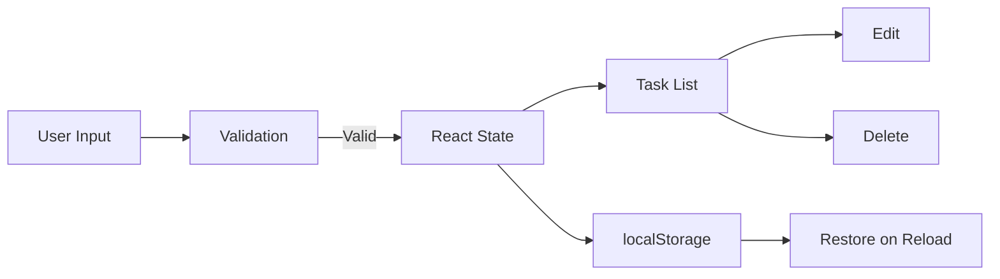

<div align="center">

# ✅ Todo App

A responsive task-management application built with **React** and **Vite**, featuring deadlines, local persistence, editing, validation, and a glassmorphism-inspired interface.


</div>

---

## 🌐 Live Demo

**Netlify deployment:** use the live demo link configured in the repository description/README.

---

## ✨ Features

- Create tasks
- Edit existing tasks
- Delete tasks
- Deadline/date support
- Input and deadline validation
- Persistent task storage with `localStorage`
- Responsive interface
- Reusable React components
- Fast development workflow with Vite

---

## 🧱 Project Structure

```text
src/
├── components/
├── interfaces/
├── pages/
├── App.jsx
├── index.css
└── main.jsx
```

The project separates reusable UI pieces, page-level views, and shared interface-related definitions instead of keeping all behavior in a single component.

---

## 🔄 Application Flow



---

## 🛠️ Tech Stack

- React
- Vite
- JavaScript / JSX
- CSS
- Browser `localStorage`
- ESLint tooling

---

## 🚀 Getting Started

### Prerequisites

- A Node.js version compatible with the project's current Vite setup
- npm

### Installation

```bash
git clone https://github.com/halilkrm/todo-app.git
cd todo-app
npm install
npm run dev
```

Open the local URL printed by Vite in your terminal.

---

## 📦 Available Scripts

```bash
npm run dev
npm run build
npm run lint
npm run preview
```

---

## 💾 Persistence

Tasks are stored in the browser via `localStorage`.

This means:

- tasks survive page refreshes,
- no backend is required for the current persistence flow,
- data remains browser/device-specific unless a backend is added.

---

## ⚠️ Repository Hygiene

For a clean production repository, generated and machine-specific folders should not be version-controlled.

Recommended `.gitignore` coverage:

```gitignore
node_modules/
dist/
.DS_Store
.env
.env.*
```

After adding the ignore rules, already tracked generated folders can be removed from Git tracking without deleting local copies:

```bash
git rm -r --cached node_modules dist
find . -name ".DS_Store" -delete
git add .gitignore
git commit -m "chore: remove generated files from repository"
```

---

## 🗺️ Possible Improvements

- Task completion status and filters
- Priority levels
- Unit/component tests
- Accessibility audit
- Backend synchronization
- User authentication
- CI workflow for lint/build checks

---

## 📄 License

This project is licensed under the MIT License. See the `LICENSE` file for details.
